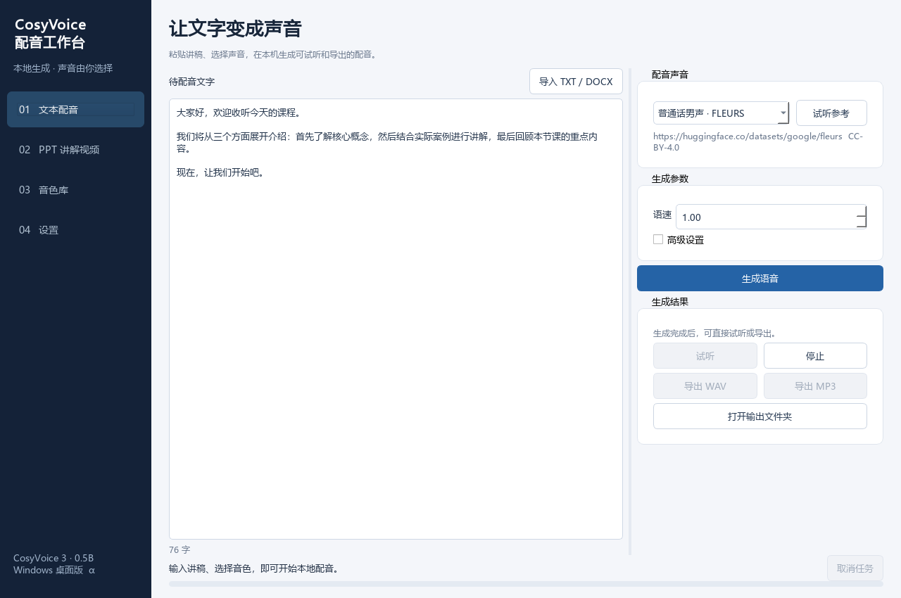
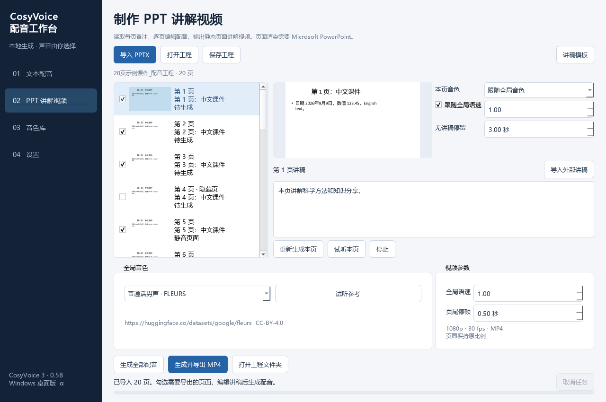

# CosyVoice 配音工作台

Windows 本地配音与 PPT 讲解视频工具，基于 [QwenAudio/CosyVoice](https://github.com/QwenAudio/CosyVoice)
派生，保留上游历史。桌面开发分支为 `desktop`，`main` 保留作上游参照。
本项目由社区独立维护，不代表原项目官方桌面客户端。

当前正式版本：**0.1.2**。已实机验收 RTX 2070 Super；其他型号仍按实际证据标注。
安装器见 [v0.1.2 Release](https://github.com/doudou03015/CosyVoice-Desktop/releases/tag/v0.1.2)。显卡验证状态见
[兼容与验收表](docs/compatibility.md)，不能将环境选择测试等同于实际模型运行成功。





## 功能

- 文本配音：输入或导入 TXT、DOCX，选择音色和语速，分段生成、试听，导出 WAV/MP3。
- PPT 讲解视频：读取 PPTX 备注，预览外部讲稿的页码映射，逐页编辑、配音、试听与排除页面。
- 音色库：自建音色与无需保存到库中的临时参考录音；用户自己的预设可删除或恢复，旧版六段 FLEURS/AISHELL-3 音色已从产品移除。
- 直接录音：在音色库、文本配音和 PPT 配音中按稿录制，支持麦克风选择、音量显示、试听、重录和保存；无需语音识别模型。
- 工程：保存源课件副本、编辑讲稿、实际使用的音色副本和结果；重新打开后继续处理。
- 设置：检测显卡、选择组件与模型位置、校验已有模型、执行真实配音和编码自检。

长文本串行分批合成，再合并为一条音频。中文优先保留完整句子，避免在列举的顿号中间切开；
长句仍按长度分批。仅缩短批次接缝处过长且明确的静音，保留句内自然停顿。
界面显示的批次数不是 PPT 页数，“页尾停顿”只在视频换页时添加。
取消首先在批次边界执行；超时会停止本软件创建的推理进程。
已完成页面的 WAV 会保留。修改讲稿或音色后，仅相应内容失去缓存资格。
升级不会自动替换以前完成的音频；如需使用新的衔接方式，请选择“重新生成本页”。
删除音色不会替换当前草稿和工程已保存的声音；音色库为空时仍可编辑、保存 PPT 工程。
录音建议 3～15 秒，30 秒自动停止，不足 3 秒或静音录音不能保存。详见
[音色管理与录音](docs/voice-management.md)。

## 安装与首次启动

从 [Releases](https://github.com/doudou03015/CosyVoice-Desktop/releases) 下载 Windows 安装器，
安装后打开“CosyVoice 配音工作台”。在“设置”选择组件位置，点击准备组件并完成自检。
普通用户不需要另外安装 Python，也不需要手动选择 CUDA 版本。

模型较大，首次准备需要联网；下载支持续传和 SHA-256 校验。已有模型可选择目录并校验复用。
**从 v0.1.0 升级：**关闭软件后覆盖安装到原程序目录，保留原组件位置，再点击“自动准备所需组件”。
v0.1.1 修复首次下载模型配套 WeText 文件时的 HTTP 401；这四个固定版本文件已随安装包提供。
已完成且校验通过的下载和已安装组件直接复用，未完成文件尝试续传。不要卸载或清理系统 Temp 下载缓存；
如果缓存已被清理，或文件校验失败，则需要补下载对应文件。设置、音色、工程及生成结果保留。
v0.1.2 已从产品移除旧六段参考样本，防止首次启动误用旧音色；不会显示或恢复它们。
龙婉、龙书、龙橙是本机用户音色，未随公开安装包分发。请从旧电脑复制用户数据目录中的
`voices/local-presets`，或在音色库逐项导入录音。
RTX 20～40 与 RTX 50 的运行组件彼此独立，共享同一份模型。组件准备成功后可离线配音。
程序不上传讲稿、录音和工程，诊断文件只在用户点击导出时保存到本地。

如需让不同启动方式共用同一份资料，可在 EXE 同级放置 `app-data-location.json`，
内容为 `{"schema_version": 1, "data_dir": "用户选择的已有数据目录绝对路径"}`。
先关闭软件，复制并校验原音色、草稿和输出，再设置此位置；不要指向空目录。
升级保留此本机配置，配置失效时会明确报错。源码开发可在项目根目录使用同名文件；
该文件含本机路径，不提交 Git，也不随安装包分发。

Windows 10（1809 及更新版本）/11 64 位；目标是 RTX 20、30、40、50 系列的 **8 GB 及以上版本**，
包含符合条件的笔记本、SUPER 和 Ti。4/6 GB 型号、GTX、AMD、Intel、CPU 配音不在首版范围。
软件检测实际显存、架构和驱动；多显卡默认选择符合条件且可用显存最多的设备。
显存不足时先关闭其他占用显存的程序，然后重试。

## PPT 与讲稿

PPT 视频需要自行安装 Microsoft PowerPoint。缺少 PowerPoint 时，普通文本配音仍可使用。
首版只支持 `.pptx` 的静态页面，不还原动画、转场和嵌入视频的动态内容。

1. 导入 PPTX 并选择工程目录，软件读取每页备注。
2. 可导入 [TXT 模板](templates/逐页讲稿模板.txt) 或同样结构的 DOCX，先检查页码对应关系再覆盖。
3. 编辑讲稿，选择统一音色；需要时调整单页音色、语速或是否导出。
4. 生成配音或导出视频。原课件不被修改，独立 WAV 按原始页码保存在工程中。

外部讲稿用独立段落“第1页”“第2页”等分隔。重复或越界页码需要先修正；未匹配页面保留原备注。
隐藏页默认排除；空讲稿页默认静音停留 3 秒，可修改。非空页按实际音频长度加 0.5 秒页尾停顿，
全局可调。视频为 1920×1080、30 fps、H.264/AAC MP4，按原比例留边补齐，不裁切。

## 开发与构建

桌面界面使用独立的 Python 3.12 开发环境，推理组件使用计划指定的 Python 3.10。
界面通过 QProcess 和 JSON 行消息调用推理工作进程，界面进程不加载 PyTorch、不运行网页服务。

```powershell
git clone --recurse-submodules https://github.com/doudou03015/CosyVoice-Desktop.git
cd CosyVoice-Desktop
git switch desktop
python -m pip install -r requirements-gui-build.txt
python -B -m desktop_app
```

开发时请在设置中选择独立推理 Python 与模型目录。不要把虚拟环境、模型或用户工程提交到 Git。
完整依赖锁定、组件校验清单及构建脚本位于 `requirements-*` 和 `packaging/`。
架构接口见 [architecture.md](docs/architecture.md)。测试及构建临时目录必须放在系统 Temp 下。
完整构建步骤见 [Windows 发布构建](docs/build-release.md)。

`origin` 指向自己的 Fork，`upstream` 指向官方仓库。开发从 `desktop` 建功能分支；
上游更新在独立分支测试模型与桌面兼容性后再合并，禁止直接覆盖已验证的运行环境。

## 许可

CosyVoice 与本项目新增源码使用 [Apache-2.0](LICENSE)，修改说明见 [NOTICE](NOTICE)。
原始介绍保留于 [UPSTREAM-README.md](docs/UPSTREAM-README.md)。模型、Qt、FFmpeg 与用户导入的音色分别遵守各自许可，详见 [分发说明](docs/licenses.md)。
